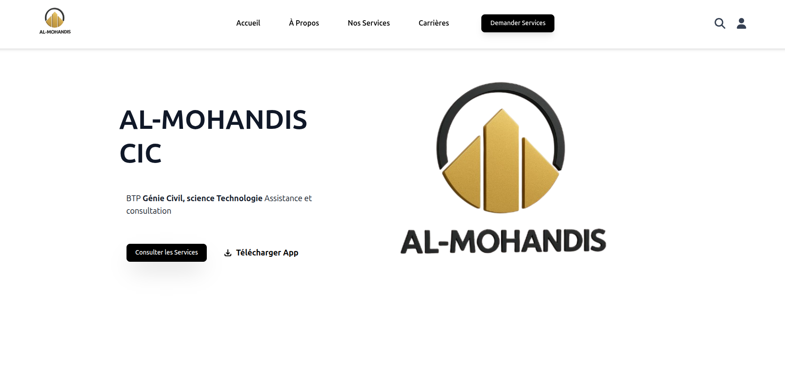

AL-MOHANDIS CIC

Entreprise spécialisée en  *Génie Civil, Études Techniques et Travaux*. Ce projet est une vitrine web présentant les services de la société Al-Mohandis CIC.

Capture d'écran de l'accueil

(https://github.com/doudouabdoulaye/AL-MOHANDIS)

Technologies utilisées

- React (avec Vite)
- Tailwind CSS
- Git & GitHub

Structure du projet

src/
├── components/    # Composants réutilisables
│ ├── Header.tsx   # Navigation principale
│ ├── Hero.tsx     # Section héro
│ ├── Features.tsx # Section fonctionnalités
│ ├── Sidebar.tsx  # Barre latérale
│ └── Footer.tsx   # Pied de page
├── layouts/       # Layouts de page
│ ├── MainLayout.tsx      # Layout principal (Header + Footer)
│ └── SidebarLayout.tsx   # Layout avec sidebar
├── pages/                # Pages de l'application
│ └── Dashboard.tsx       # Page tableau de bord
└── App.tsx               # Composant racine

 Fonctionnalités

- Présentation des services de l’entreprise
- Navigation fluide entre les sections
- Interface claire et responsive
- Boutons : Consulter les services, Demander service, Télécharger app

Services présentés

Ingénierie & Études
- Études Topographiques et Topométriques  
- Études Hydrauliques
- Études Hydrogéologiques  
- Études Géophysiques  
- Campagnes Géotechniques  
- CAO/DAO

Travaux
- Aménagements Hydro-Agricoles  
- Civil Construction Services (CCS)  
- Water Well Drilling Services (WWDS)

Lancer le projet

bash
npm install
npm run dev

